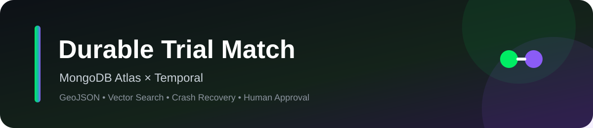

<p align="center">
  
</p>

# Durable Trial Match

**MongoDB Atlas + Temporal MVP for durable clinical-trial matching with vector search, GeoJSON filtering, crash recovery, and human approval.**

<p>
  
  
  
  
  
</p>

> [!IMPORTANT]
> This repository is a **synthetic technical demo**, not a clinical application. It must not be used for diagnosis, treatment decisions, or real patient care.

## Why this exists

Most AI demos prove that an LLM can answer a question. **Durable Trial Match** demonstrates what happens when the application also has to survive failures, apply hard operational constraints, and wait safely for a human decision.

The split is intentionally simple:

- **MongoDB Atlas** owns operational data, GeoJSON, structured eligibility filters, Vector Search, match state, and Change Streams.
- **Voyage AI** generates document and query embeddings.
- **Temporal** owns durable ingestion, retries, crash recovery, workflow history, and human-in-the-loop waiting.
- **LLM (optional)** normalizes the synthetic EHR text and generates the final demo summary.

## 🟢 Demo 1 — GeoJSON + metadata pre-filtering + Vector Search

Semantic similarity should not decide whether a trial is physically reachable or whether a patient satisfies hard eligibility constraints.

```text
Synthetic patient
      │
      ├── age / stage / recruiting status
      │
      └── GeoJSON location + radius
                    │
                    ▼
          MongoDB $geoNear
                    │
             nearby trialIds
                    │
                    ▼
       MongoDB $vectorSearch
       strict metadata filter
                    │
                    ▼
          semantic ranking
```

Trial locations live in `trial_sites` as GeoJSON `Point` values with a `2dsphere` index.

The application first uses `$geoNear` to resolve nearby trial IDs. Those IDs are then passed into the `$vectorSearch` pre-filter together with strict metadata conditions such as:

```javascript
{
  "$and": [
    { "trialId": { "$in": nearbyTrialIds } },
    { "minAge": { "$lte": patientAge } },
    { "maxAge": { "$gte": patientAge } },
    { "stage": { "$eq": patientStage } },
    { "status": { "$eq": "RECRUITING" } }
  ]
}
```

This is deliberately two MongoDB queries because `$vectorSearch` must be the first stage of the aggregation pipeline in which it appears.

**Code:** [`activities/search_clinical_trials.py`](activities/search_clinical_trials.py)

## 🟣 Demo 2 — The Token-Saver crash recovery

The Temporal workflow exposes five meaningful boundaries:

```text
1. Extract EHR
2. Embed patient query
3. Search clinical trials
4. Check drug interactions
5. Generate summary
```

Enable the demo failure:

```bash
DEMO_FAIL_DRUG_CHECK_ONCE=true
```

The first attempt at step 4 fails:

```text
✓ Extract EHR
✓ Embed patient query
✓ Search clinical trials
✗ Check drug interactions   ← injected timeout
```

Temporal retries from the failed Activity boundary. Completed Activity results are already recorded in Workflow history, so the completed extraction, embedding, and search calls are not needlessly executed again.

```text
✓ Extract EHR
✓ Embed patient query
✓ Search clinical trials
✓ Check drug interactions   ← retry succeeds
✓ Generate summary
```

For the more dramatic version, set a longer `DEMO_DRUG_CHECK_DELAY_SECONDS`, kill the worker during step 4, and restart it.

**Code:** [`workflows/match_patient.py`](workflows/match_patient.py) and [`activities/check_drug_interactions.py`](activities/check_drug_interactions.py)

## 🟠 Demo 3 — Async human-in-the-loop approval

After a recommendation is generated, the workflow writes:

```json
{ "status": "AWAITING_PHYSICIAN_APPROVAL" }
```

to MongoDB and waits for a Temporal Signal.

```python
await workflow.wait_condition(lambda: self.approval is not None)
```

The review action sends `APPROVE` or `REJECT`. Temporal resumes the durable workflow, updates MongoDB, and MongoDB Change Streams expose the business-state transition.

```text
Temporal Signal
      │
      ▼
Workflow resumes
      │
      ▼
MongoDB matches.status = APPROVED
      │
      ▼
Change Stream
      │
      ▼
Observer / UI sees the change
```

**Code:** [`client/approve_match.py`](client/approve_match.py) and [`app/change_stream.py`](app/change_stream.py)

## Architecture

```text
                         ┌───────────────────────┐
                         │      Streamlit UI     │
                         │ Match + Review        │
                         └───────────┬───────────┘
                                     │
                           workflow / signal
                                     │
                                     ▼
                         ┌───────────────────────┐
                         │       Temporal        │
                         │                       │
                         │ IngestTrialWorkflow   │
                         │ MatchPatientWorkflow  │
                         └───────────┬───────────┘
                                     │
             ┌───────────────────────┼────────────────────────┐
             │                       │                        │
             ▼                       ▼                        ▼
      ┌─────────────┐       ┌──────────────────┐       ┌─────────────┐
      │  Voyage AI  │       │  MongoDB Atlas   │       │     LLM     │
      │ embeddings  │       │                  │       │  optional   │
      └─────────────┘       │ patients         │       └─────────────┘
                            │ raw_trials       │
                            │ trial_chunks     │
                            │ trial_sites      │
                            │ matches          │
                            │                  │
                            │ 2dsphere         │
                            │ Vector Search    │
                            │ Change Streams   │
                            └──────────────────┘
```

## Repo layout

```text
durable-trial-match/
├── README.md
├── assets/banner.svg
├── requirements.txt
├── config.py
├── worker.py
├── activities/
├── workflows/
├── client/
├── app/
├── scripts/
└── data/
```

No separate giant design `.md` file. The architecture is represented by the code that implements it.

## Demo configuration

Everything is intentionally in one place: [`config.py`](config.py).

```python
MONGODB_URI = "mongodb+srv://..."
MONGODB_DB = "durable_trial_match"

VOYAGE_API_KEY = "..."
VOYAGE_MODEL = "voyage-4"

mongo_client = MongoClient(MONGODB_URI)
db = mongo_client[MONGODB_DB]

voyage_client = voyageai.Client(api_key=VOYAGE_API_KEY)
```

There is no `.env`, `getenv`, or separate database helper in this MVP.

## Quick start

### 1. Configure Python

```bash
python -m venv .venv
source .venv/bin/activate
pip install -r requirements.txt
```

Open `config.py` and paste the demo values directly:

```python
MONGODB_URI = "mongodb+srv://..."
VOYAGE_API_KEY = "..."
```

`config.py` creates the shared MongoDB database handle and Voyage client used by the demo.

### 2. Verify MongoDB Atlas

You can either put the Atlas URI in `.env`:

```bash
MONGODB_URI="mongodb+srv://..."
MONGODB_DB="durable_trial_match"
```

and verify it:

```bash
python scripts/check_atlas.py
```

or launch Streamlit and enter the Atlas connection string directly in the sidebar. The UI performs an Atlas `ping` before loading any MongoDB-backed screens.

> The Temporal worker and command-line scripts still use `.env`, so for the full end-to-end demo set `MONGODB_URI` there as well.

### 3. Start Temporal locally

```bash
temporal server start-dev
```

### 3. Seed synthetic data and create indexes

```bash
python scripts/seed_data.py
python scripts/create_indexes.py
```

### 4. Start the Temporal worker

```bash
python worker.py
```

### 5. Run durable trial ingestion

```bash
python scripts/ingest_trials.py
```

### 6. Start a patient match

```bash
python client/start_match.py patient-demo-001 --radius 50
```

Or launch the UI:

```bash
streamlit run app/ui.py
```

### 7. Watch MongoDB Change Streams

```bash
python app/change_stream.py
```

### 8. Approve or reject

```bash
python client/approve_match.py <workflow-id> approve "Dr. Demo"
```

or:

```bash
python client/approve_match.py <workflow-id> reject "Dr. Demo"
```

## MongoDB collections

| Collection | Purpose |
|---|---|
| `patients` | Synthetic operational patient profiles |
| `raw_trials` | Source documents before durable ingestion |
| `trial_chunks` | Embedded trial text + strict metadata used by Vector Search |
| `trial_sites` | GeoJSON recruiting locations |
| `matches` | Application-visible workflow/result state |

## Idempotent ingestion

The ingestion workflow produces deterministic chunk IDs:

```text
trialId:version:chunk:NNN
```

Each write uses an upsert. If Temporal retries a MongoDB Activity, it converges on the same logical record instead of creating duplicate vectors.

## Synthetic dataset design

The included data intentionally contains:

- a nearby, highly relevant eligible trial,
- a strong semantic match with the wrong stage,
- a matching trial hundreds of miles away,
- a nearby trial outside the patient's age range,
- a matching trial that is closed,
- weaker broad-condition matches,
- multiple recruiting sites for the same trial.

That makes **hard filtering vs semantic ranking** visible during the demo.

## The point

> **MongoDB owns the operational truth and retrieval. Temporal owns reliable execution across that truth.**
